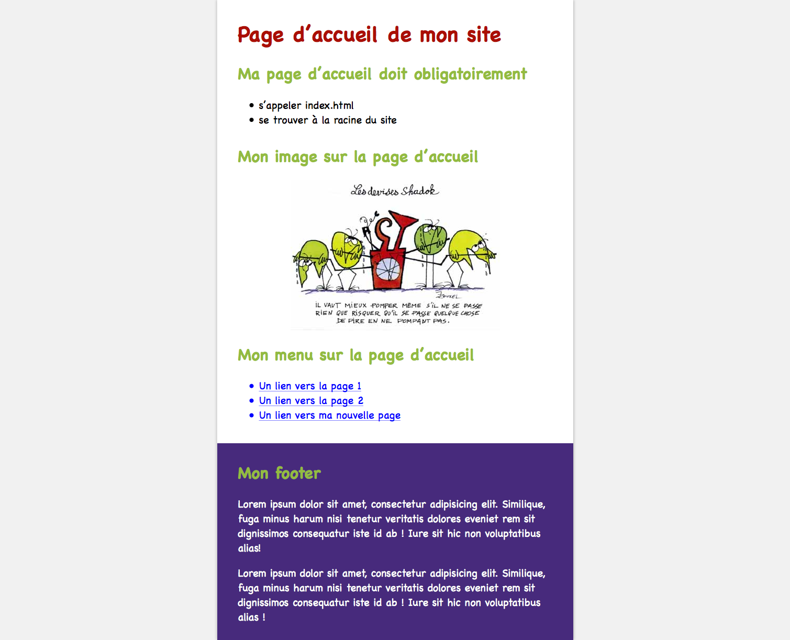
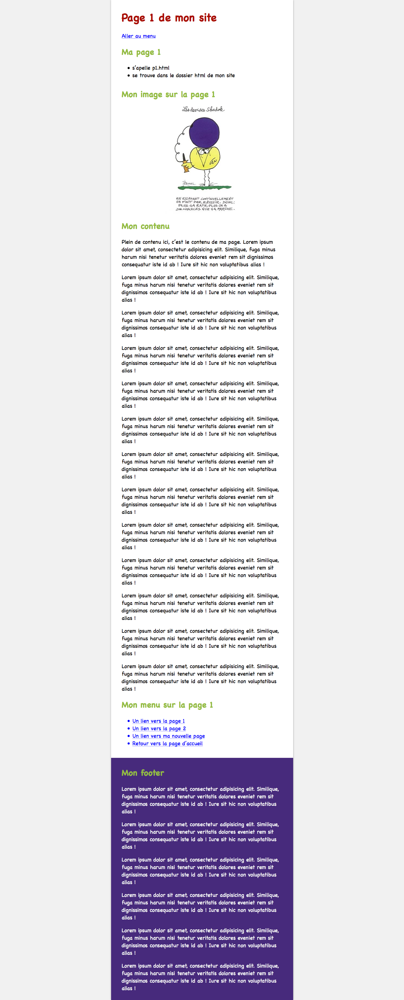
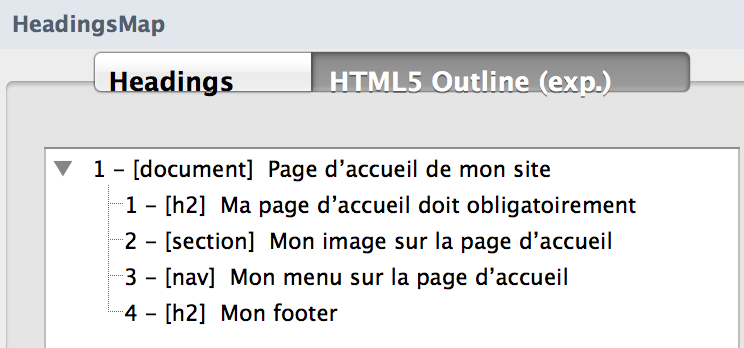
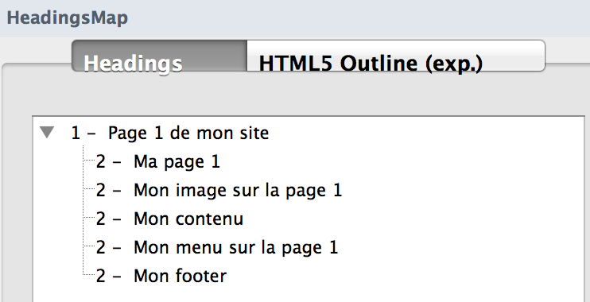
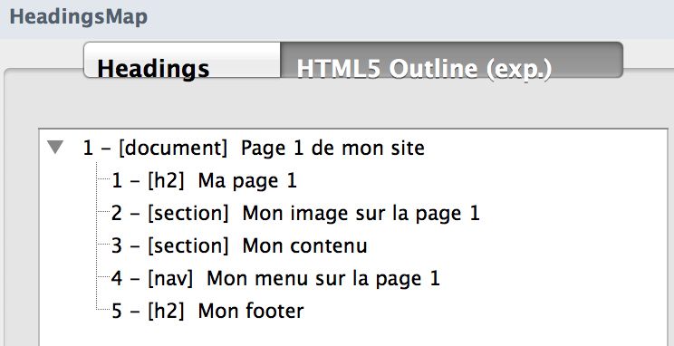

# html-relative-paths

> HTML exercise about (relative) paths

* * *

**html-relative-paths** is an educational project, which will be used for HTML courses.

**Note:** the school where the course is given, the [HEPL](http://www.provincedeliege.be/hauteecole) from Liège, Belgium, is a french-speaking school. From this point, the instruction will be in french. Sorry.

* * *

## Exercice sur les chemins relatifs

Réaliser le site « monSite » contenant 4 pages :

- une page d’accueil (fichier `index.html`)
- page 1 (fichier `page1.html`)
- page 2 (fichier `page2.html`)
- nouvelle page (fichier `nv.html`)

Les fichiers html, images et css sont fournis et déjà correctement organisés dans les dossiers et sous-dossiers requis. L’arboresence est la bonne et doit rester telle quelle, vous n’avez pas le droit d’y toucher. 

Les rendus finaux que vous devez obtenir se trouvent dans le dossier rendus.

Vous trouverez également dans ce dossier des copies d’écran des outlines que vous devez obtenir pour la page d’accueil et la page 1 selon les deux algorithmes (html4 et html5). Les outlines à obtenir pour les deux autres pages sont semblables.

Votre travail consiste à compléter les 4 fichiers html fournis en suivant les consignes indiquées en commentaire au début de chacun des fichiers.

### Rappels théoriques et conseils

#### Les ressources doivent être liées en utilisant les chemins relatifs :

- `./` = je reste où je suis
- `../` = je remonte d’un niveau

#### Vos balises img doivent posséder 4 attributs reneignant :

-  l’adresse du fichier image 
-  le texte alternatif
-  la largeur de l’imgae (pourquoi ?)
-  la hauteur de l’image (pourquoi ?)

Consulter le livre de référence pour toutes informations utiles

#### Vérifiez la correction typographique en vous servant du memento fourni au cours :

- apostrophes
- guillemets
- majuscules
- tirets
- points de suspension
- ligatures
- …

#### Bonnes pratiques à respecter :

- Le texte alternatif d’une image doit être le texte contenu dans l’image lorsqu’il y en a un dans l’image (recommandation en matière d’accessibilité)

### Résultats attendus

Voici une capture d’écran de la page d’accueil avec la feuille de style appliquée :

Voici une capture d’écran de la page 1 avec la feuille de style appliquée :

Le plan de votre page d’accueil doit correspondre au résultat suivant :

Le plan de votre page 1 doit correspondre au résultat suivant :

Les pages doivent bien entendu être valides.

### Références utiles à lire en matière d’accessibilité :

[Directives d’accessibilité concernant le title sur le site anysurfer](http://www.anysurfer.be/fr/en-pratique/directives/directive/2-2-1-chaque-page-possede-un-titre-significatif)

[Directives d’accessibilité concernant l’attribut alt d’une image sur le site anysurfer](http://www.anysurfer.be/fr/en-pratique/directives/directive/2-3-1-chaque-image-a-un-attribut-alt)

[L'attribut alt sur le site de la WAI](http://www.w3.org/WAI/GL/techniques.htm)

[Contenu de l’attribut alt sur le site de la WAI](http://www.w3.org/WAI/GL/techniques.htm#Appendix%20B)
